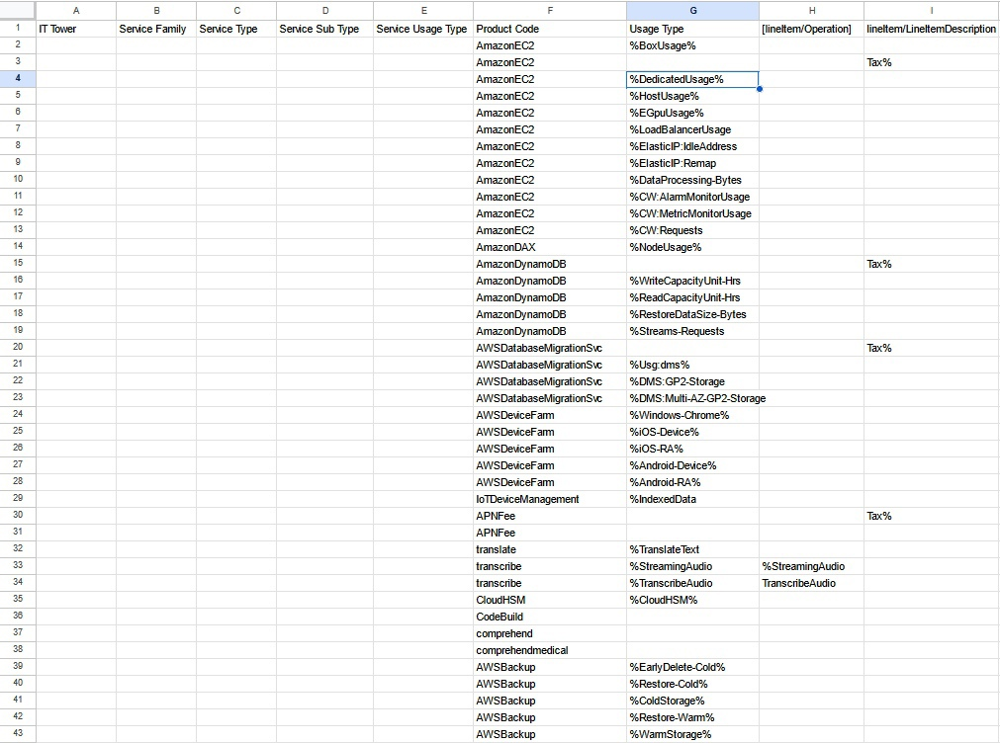

# Аналитическая работа 2 (AWS)

### Состав команды

- [Никифоров Савелий](https://t.me/waswel) 
- [Иванова Анастасия](https://t.me/Crevetka960) 
- [Ершов Николай](https://t.me/kropacek)
  
### Цель работы
Знакомство с облачными сервисами. 
Понимание уровней абстракции над инфраструктурой в облаке. 
Формирование понимания типов потребления сервисов в сервисной-модели. 
Сопоставление сервисов между разными провайдерами. 
Оценка возможностей миграции на отечественные сервисы.

### Дано

### Описание сервисов
Ниже будут описанные сервисы из условия

**AmazonEC2** - это служба позволяющая пользователю с помощью веб-интерфейса арендовать виртуальные машины. 
Для их запуска используются заданные образы, это сокращает время загрузки. 
Кроме того пользователю с помощью простых инструментов может настроить и имеет полный доступ к ним.

**AmazonDAX** - это сервис кеширования созданный для Amazon DynamoDb. DAX обеспечивает повышение производительности.
DAX ускоряет работу с таблицами DynamoDb. Сервис управляет аннулированием кэша, заполнением данных или управляет кластером.

**Amazon DynamoDb** - это часть пакета веб сервиса Amazom позволяющая управлять базами данных noSQL в формате ключ-значение.
Пользователь может определить требуемую производительность, но не ёмкость.
DynamoDb автоматически распределяет данные, для заданной производительности.

1. DynamoDB Streams: позволяет захватывать изменения данных в таблице DynamoDB в режиме реального времени и реагировать на них.
2. DynamoDB Accelerator (DAX): это подсервис, который предоставляет кэширующий слой для таблиц DynamoDB, улучшающий производительность и снижающий задержки при доступе к данным.
3. DynamoDB On-Demand: это подвид DynamoDB, который позволяет платить только за фактически использованные операции чтения и записи, без необходимости выделения ресурсов заранее.

**AWS Database Migration Svc** - это управляемый сервис миграции и репликации данных.
Он помогает отслеживать задачи репликации, сбои хостов и установить автоматическую замену хоста, в случае сбоя.

1. AWS Database Migration Service for SAP ASE: это подсервис, специально предназначенный для миграции данных из и в базы данных SAP ASE.
2. AWS Database Migration Service for Snowball: это подсервис, который позволяет использовать физический устройство AWS Snowball для миграции данных в больших масштабах.
3. AWS Database Migration Service for Microsoft SharePoint: этот подсервис предоставляет возможность миграции данных между базами данных SharePoint, включая миграции из старых версий SharePoint в новые.

**AWS Device Farm** - это сервис, позволяющий тестировать мобильные и веб приложения.
Тесты проводятся на реальных мобильных устройствах и в нескольких браузерах одновременно на компьютерах.

**Iot Device Management** - это платформа, предоставляющая возможность отслеживать состояние на низком уровне, контролировать процессы Iot.
Так же осуществление удалённого мониторинга парка с графической визуализацией, управление обновлениями парка, создание иерархии устройств и возможность фильтровать их по поиску.
Это упрощает их организацию по любым признакам.

**APNFee** - это это центр партнёров, где партнёры могут получить полный доступ к программам AWS Amazon.
С помощью него партнёры смогут улучшить (с помощью преимуществ AWS) поставление управляемых сервисов (MSP), или запросить маркетинговую, коммерческую поддержку.

**Amazon translate** - это сервис машинного перевода. Позволяет переводить тексты.
Оплата рассчитывается по факту использования, то есть например по количеству обработанных символов.

**Amazon transcribe** - это сервис автоматического распознования речи. Преобразует аудио в текст.
Использует машинное обучение для преобразования, что обеспечивает эффективную обработку большим объёмов аудио.

1. Amazon Transcribe Medical: Данный подсервис предоставляет медицинскую транскрипцию и распознавание речи, специально разработанные для работы с медицинской терминологией. Он помогает автоматически транскрибировать медицинские диктаты, заметки и консультации.
2. Amazon Transcribe Streaming: Это подвид Amazon Transcribe, который позволяет транскрибировать речь в режиме реального времени (streaming). Он предназначен для обработки потокового аудио и видео контента, таких как трансляции, видеоконференции и другие приложения, где требуется автоматическое распознавание речи в реальном времени.
3. Amazon Transcribe Language Identification: Этот подвид Amazon Transcribe предназначен для определения языка входящего аудио или видео контента. Он может автоматически определить язык и применить соответствующие модели распознавания речи для более точной транскрипции.
4. Amazon Transcribe Batch: Это подвид Amazon Transcribe, который предоставляет возможность пакетной обработки больших объемов аудио- или видеофайлов. Он позволяет загружать файлы для транскрибирования в пакетном режиме, что полезно при обработке больших аудиоархивов или коллекций видео контента.

**Amazon CloudHSM** - это сервис позволяющий надёжно генерировать и хранить сгенерированные ключи шифрования.
Также он предоставляет доступ к ключам на оборудовании и клиенту, прошедшему проверку FISP. 

**AWS CodeBuild** - это полностью управляемый сервис непрерывной интеграции,
который компилирует исходный код, выполняет тестирование и формирует пакеты программного обеспечения.

**Amazon Comprehend** - это это сервис обработки естественного языка (NLP), в котором для обнаружения в тексте аналитических данных применяются технологии машинного обучения.
Amazon Comprehend предоставляет API для распознавания сущностей, в том числе, пользовательской классификации, извлечения ключевых фраз, анализа эмоциональной окраски и так далее.
Это позволяет встраивать механизмы обработки естественного языка в приложения. Сущности будут представленные в итоге в формате JSON.

1. Amazon Comprehend Entity Recognition: подсервис идентификации и извлечения именованных сущностей (людей, организаций, мест и других) из текстовых данных.
2. Amazon Comprehend Phrase Extraction: подсервис извлечения ключевых фраз из текстовых данных. Сервис анализирует текст на предмет важных выражений и фраз, которые помогают понять содержание текста.
3. Amazon Comprehend Topic Modeling: подсервис выявления наиболее важных тем в коллекции текстов. Сервис может анализировать большие объемы текста и выявлять наиболее значимые темы, которые присутствуют в нем.

**Amazon Comprehend medical** - это сервис обработки естественного языка (NLP), который использует машинное обучение,
предварительно обученное для понимания и извлечения данных о здоровье из медицинского текста, например рецептов, процедур или диагнозов.

**AWS Backup** - это полностью управляемый сервис, который централизует и автоматизирует сервисы защиты данных AWS, такие как Amazon S3, Amazon FSx, Amazon EC2 и RDS,
а также гибридные рабочие нагрузки. Также сервис предоставляет резервное копирование.

### Сопоставление сервисов AWS и русского аналога.

AmazonEC2 - Yandex Compute Сloud (имеет настройки машин и готовые образы)

Amazon DynamoDb - Yandex Managed Service for Redis

AWS Database Migration Svc - Yandex Data Transfer (нет решения проблем со сбоями хостов) 

Iot Device Management - Yandex IoT Core

APNFee - Yandex Cloud (Professionals) (партнерская программа)

Amazon translate - Yandex Translate

Amazon transcribe - Yandex SpeechKit

Amazon CloudHSM - Yandex Key Management Service

AWS CodeBuild - Yandex Managed Service for GitLab

Amazon Comprehend - Yandex SpeechSense (нет извлечения сущностей предоставленном в формате json)

AWS Backup - Yandex Cloud Backup

На другие не перечисленные сервисы аналогов нет.

### Таблица

| Type                          | AWS                        | Yandex Cloud                      |
|-------------------------------|----------------------------|-----------------------------------|
| Virtual machines and servers  | AmazonEC2                  | Yandex Compute Сloud              |
| Caching for DynamoDB          | AmazonDAX                  |                                   |
| NoSQL                         | AmazonDynamoDB             | Yandex Managed Service for Redis  |
| Database migration            | AWS Database Migration Svc | Yandex Data Transfer              |
| Iot Management and governance | Iot Device Management      | Yandex IoT Core                   |
| Mobile services               | AWS Device Farm            |                                   |
| Partner programm              | APNFee                     | Yandex Cloud (Professionals)      |
| ML translate                  | Amazon translate           | Yandex Translate                  |
| ML transcribe                 | Amazon transcribe          | Yandex SpeechKit                  |
| Security and Encryption       | Amazon CloudHSM            | Yandex Key Management Service     |
| DevOps                        | AWS CodeBuild              | Yandex Managed Service for GitLab |
| ML analysis NLP               | Amazon Comprehend          | Yandex SpeechSense                |
| ML analysis NLP (medical)     | Amazon Comprehend medical  |                                   |
| Archiving and backup          | AWS Backup                 | Yandex Cloud Backup               |

### Вывод
В ходе выполнения данной работы мы ознакомились с облачными сервисами от Amazon.
Также сделали сопоставление сервисов с сервисами Yandex Cloud. Не дял всех были найдены аналоги,
и так же в некоторых случаях аналог не выполнял все задачи. Таким образом, можно сделать вывод,
что аналоги Yandex Cloud для AWC сервисов, и миграция возможно, но в только в случае без необходимости сервисов без аналогов
или тех, у которых аналог не покрывает все возможности.
