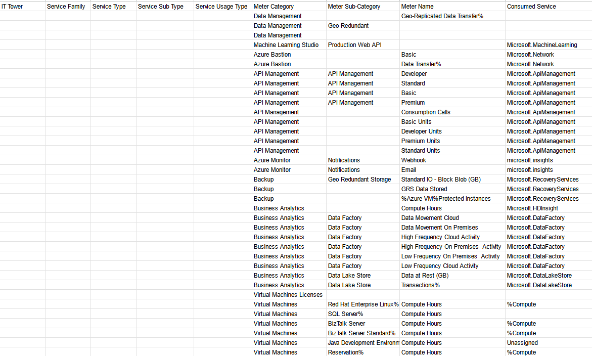

# Аналитическая работа 2 (Azure)
---
### Цель работы
Знакомство с облачными сервисами. 
Понимание уровней абстракции над инфраструктурой в облаке. 
Формирование понимания типов потребления сервисов в сервисной-модели. 
Сопоставление сервисов между разными провайдерами. 
Оценка возможностей миграции на отечественные сервисы.

### Дано

### Описание сервисов
Ниже будут описанные сервисы из условия

**Data Management** - это платформа для управления, хранения, защиты, обработки и анализа и использования данных. Например, Azure Data Manager for Energy помогает энергетическим компаниям получать полезные аналитические сведения, повышать производительность работы и быстрее выпускать решения на рынок. Сервис использует облачную платформу данных OSDU.

**Machine Learning Studio** - это облачный web-сервис разработки, позволяющей построение и использование сложных моделей машинного обучения в наглядной форме.

**Azure Bastion** - это полностью управляемая служба PaaS, которая обеспечиваеть безопасное подключение к виртуальным машинам через частный IP-адрес. 
Она обеспечивает безопасное и простое подключение RDP/SSH к виртуальным машинам через TLS из портал Azure или через собственный клиент SSH или RDP.

**API Management** - это гибридная мультиоблачная платформа управления для интерфейсов API во всех средах.
Сервисы которой позволяют разработчикам и компаниям создавать, анализировать, применять и масштабировать интерфейсы API в безопасных средах.

**Azure Monitor** - это служба для мониторинга и для сбора, анализа и реагирования на данные мониторинга из облачных и локальных сред.

**Azure Backup** - это сервис для выполнения резервного копирования и восстановления файлов и папок из облака, а также обеспечивания удаленной защиты от потери данных. 

**Business Analytics** - это сервис для анализа данных, статистических моделей и других количественных методов с упором на статистический анализ для принятия решений.
Данные могут передавться через использование Data Lake Store, которое также используется для других сервисов анализа от Azure, что может оказаться удобным для компаний.

**Virtual Machines Licenses** - это сервис лицензирования серверов и виртуальный машин на системах требующим лицензию, как для Windows Server.

**Virtual Machines** - это служба позволяющая пользователю с помощью веб-интерфейса арендовать виртуальные машины. Плата взимается за посекундное использование.
Машины можно выбрать с различными характеристиками или с готовыми образами.

### Сопоставление сервисов AWS и русского аналога

Machine Learning Studio - Yandex DataSphere

Azure Bastion - Yandex Virtual Private Cloud (Сервис позвоялет выбирать внутренние IP-адреса, переназначать публичные IP-адреса между разными виртуальными машинами, что не совсем то)

Azure Monitor - Yandex Monitoring

Azure Backup - Yandex Cloud Backup

Business Analytics - Yandex DataLens 

Virtual Machines - Yandex Compute Cloud

Management and Analysis for Api - Yandex API Gateway (не совсем то, что указано. Однако позволяет управлять соединениями)

На другие, не перечисленные сервисы аналогов нет.

### Таблица

| Type                              | Azure                      | Yandex Cloud                      |
|-----------------------------------|----------------------------|-----------------------------------|
| Virtual machines and servers      | Virtual Machines           | Yandex Compute Сloud              |
| Analysis for Hybrid storage or DB | Data Management            |                                   |
| Dev. ML                           | Machine Learning Studio    | Yandex Managed Service for Redis  |
| Save connection to VM             | Azure Bastion              | Yandex Virtual Private Cloud      |
| Web applications                  | API Management             |                                   |
| Management and governance         | Azure Monitor              | Yandex Monitoring                 |
| ML analysis Data                  | Business Analytics         | Yandex DataLens                   |
| Licensing                         | Virtual Machines Licenses  |                                   |
| Archiving and backup              | AWS Backup                 | Yandex Cloud Backup               |
| Management and Analysis for API   | API Management             | Yandex API Gateway                |

### Вывод
В ходе выполнения данной работы мы ознакомились с облачными сервисами от Amazon.
Также сделали сопоставление сервисов с сервисами Yandex Cloud. Не дял всех были найдены аналоги,
и так же в некоторых случаях аналог не выполнял все задачи. Таким образом, можно сделать вывод,
что аналоги Yandex Cloud для Azure сервисов, и миграция возможно, но в только в случае без необходимости сервисов без аналогов
или тех, у которых аналог не покрывает все возможности.
